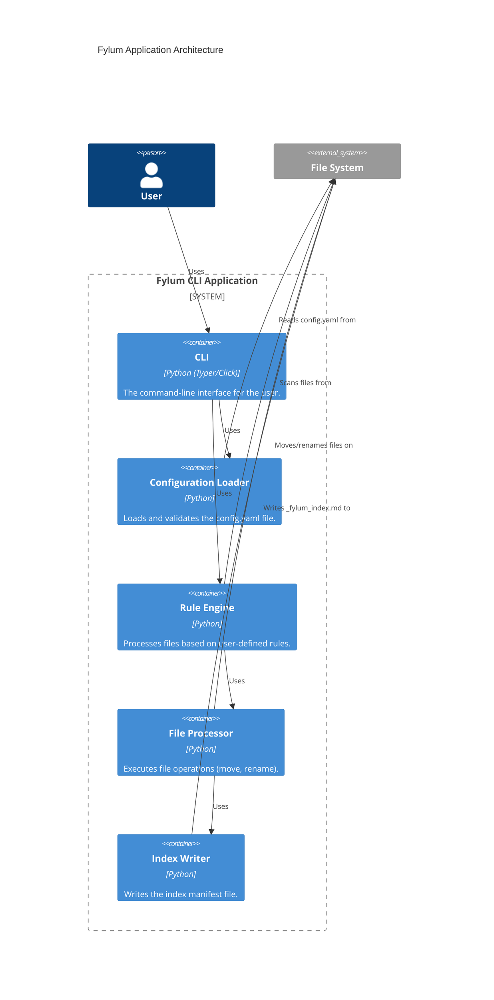
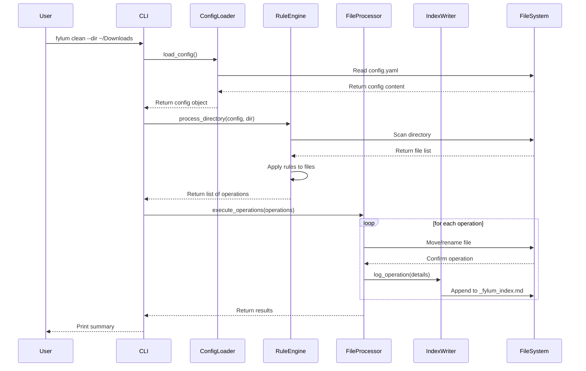

# Technical Design Document: Fylum Target Architecture

## 1. Introduction

This document describes the target architecture for the Fylum application, focusing on the V1.0.0 CLI tool. The goal is to create a modular, testable, and extensible system that can be easily maintained and evolved.

## 2. Architectural Goals & Constraints

*   **Modularity:** The system should be composed of independent, well-defined components.
*   **Testability:** Each component should be testable in isolation.
*   **Configurability:** The application's behavior should be primarily driven by a user-editable configuration file.
*   **Extensibility:** The architecture should be flexible enough to accommodate future features like a GUI and additional cleaning rules.
*   **Constraint: CLI-First:** The initial version will be a command-line application.
*   **Constraint: Python:** The application will be built using Python.

## 3. High-Level Architecture

This diagram illustrates the main components (containers) of the Fylum system and their interactions.



## 4. Component Breakdown

*   **CLI (Command-Line Interface):**
    *   The main entry point for the user.
    *   Built using a library like `Typer` or `Click`.
    *   Parses command-line arguments and options.
    *   Orchestrates the calls to other components.

*   **Configuration Loader:**
    *   Responsible for finding, reading, and parsing the `config.yaml` file.
    *   Validates the configuration against a defined schema (e.g., using `Pydantic`).
    *   Provides the configuration as a Python object to other components.

*   **Rule Engine:**
    *   Scans the target directories for files.
    *   For each file, it iterates through the user-defined rules from the configuration.
    *   Determines the action to be taken for each file (e.g., which subfolder to move it to, how to rename it).
    *   Passes a list of planned file operations to the `File Processor`.

*   **File Processor:**
    *   Receives a list of file operations from the `Rule Engine`.
    *   Executes the file operations (e.g., `os.rename`, `shutil.move`).
    *   Handles potential errors during file operations (e.g., file in use, permissions error).
    *   Notifies the `Index Writer` of successful operations.

*   **Index Writer:**
    *   Receives information about successful file movements.
    *   Appends entries to the `_fylum_index.md` file in a structured format.

## 5. Data Model

### Configuration (`config.yaml`)

```yaml
# Example config.yaml
target_directories:
  - "~/Downloads"
  - "~/Desktop"

ignore_patterns:
  - ".DS_Store"
  - "*.tmp"

rename_format: "{date:%Y-%m-%d}_{original_filename}"

rules:
  - name: "Images"
    extensions: [".jpg", ".jpeg", ".png", ".gif"]
    destination: "~/Pictures/Fylum/Images"
  - name: "Documents"
    extensions: [".pdf", ".docx", ".xlsx"]
    destination: "~/Documents/Fylum/Documents"
```

### Index Entry (`_fylum_index.md`)

```markdown
| Original Path | New Path | Timestamp |
|---|---|---|
| `~/Downloads/photo.jpg` | `~/Pictures/Fylum/Images/2025-10-07_photo.jpg` | `2025-10-07T10:00:00Z` |
```

## 6. Workflow (Sequence Diagram)

This diagram shows the sequence of events when a user runs the `fylum clean` command.



## 7. Future Considerations

*   **GUI:** A future GUI application can be built on top of the core logic defined here. The `Rule Engine` and `File Processor` can be packaged as a library that the GUI can call.
*   **Plugin Architecture:** The `Rule Engine` could be designed to allow for plugins, enabling users to add new types of rules or actions without modifying the core application.
